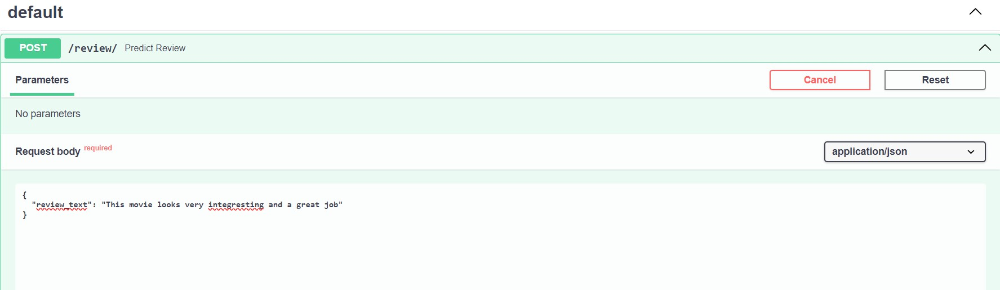
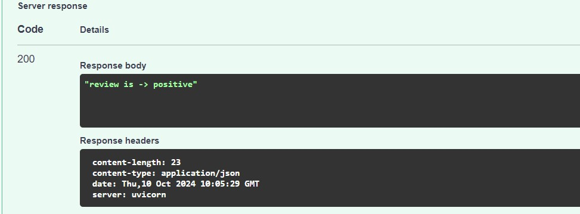

# Sentiment-Analysis-using-BERT
BERT - Bidirectional Representation for Transformers 

BERT (Bidirectional Encoder Representations from Transformers) is a transformer-based model designed for Natural Language Processing (NLP) tasks.
It revolutionized the way NLP models handle text by introducing bidirectional context understanding, making it highly effective for tasks like question answering, text classification, and named entity recognition.

BERT is pre-trained on large corpora of text (e.g., Wikipedia, BookCorpus) using two tasks: Masked Language Modeling (MLM) and Next Sentence Prediction (NSP).
we are using BERT to be fine-tuned on reviews of sentiment analysis task

## Table of Contents
- [Project Overview](#project-overview)
- [Data Sources](#data-sources)
- [EDA](#exploratory-data-analysis)
- [Assumptions](#assumptions)
- [Machine learning model](#machine-learning-model)
- [Loss function](#loss-function)
- [Making Predictions](#making-predictions)
- [Deployee model](#deployee-model)

## Project Overview
  
The goal of this project is to build a model using bert transformers that classifies the given input review is positive or negative.

## Data Sources
import movie reviews hugging face datasets
https://huggingface.co/datasets/stanfordnlp/imdb

refernce bert documentations from https://huggingface.co/docs/transformers/model_doc/bert

## Exploratory Data Analysis
25,000 train and 25,000 test reviews

## Assumptions
Fine-tuning a BERT model involves taking a pre-trained BERT model and adapting it to perform a specific NLP task, such as text classification, named entity recognition, or question answering. The pre-trained BERT model has already learned a lot about the structure of the language from vast amounts of unlabeled text data, so fine-tuning allows you to apply this knowledge to your task with task-specific labeled data.

1. Batch Size: Fine-tuning BERT can be memory intensive. Hence smaller batch size used 4.
2. Learning Rate: Typical learning rates for fine-tuning BERT are in the range of 1e-5 to 5e-5. in this project we used 2e-5.
3. Epochs: Generally, 3-5 epochs of fine-tuning are enough. BERT tends to overfit if trained for too many epochs.

## Machine learning model
- [**ML Code**](BERT.ipynb)

## Loss function
TFBertForSequenceClassification does not have a loss function when you compile the model is related to how Hugging Face models are structured and how they interact with TensorFlow and Keras.
we are using Pre-built Loss in Hugging Face Models.This means that the loss is already computed within the model

## Making predictions
Model is capable to predict given input(s) is positive or negative

## Deployee model
Deployee the model into my local machine using fastAPI.

